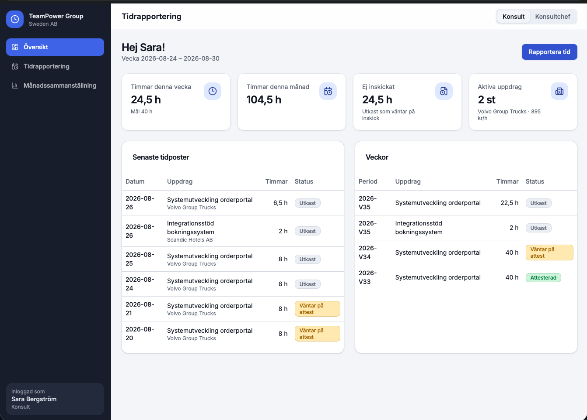
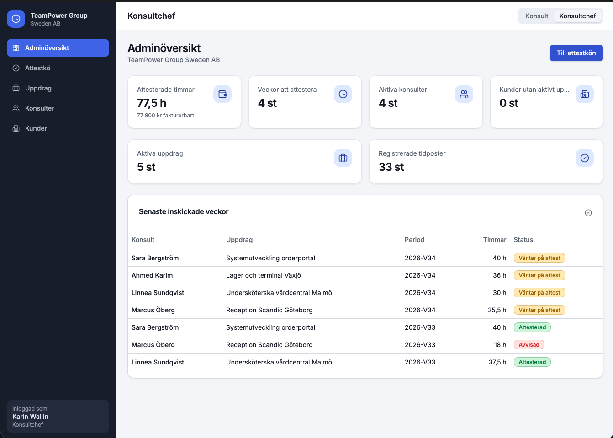

# ⏳ TimeFlow

TimeFlow är en fullstack webbapplikation byggd för att förenkla tidrapportering, attestering och kundhantering för konsulter och konsultchefer hos TeamPower. Applikationen är uppdelad i en modern React-frontend och en C# .NET Web API-backend kopplad till Supabase (PostgreSQL).

---

## 📸 Skärmdumpar

  

| Konsultvy (Tidrapportering) | Adminvy (Attesteringskö) |
| :---: | :---: |
|  |  |

---

## ✨ Huvudfunktioner

* **👤 Konsultgränssnitt:** Veckobaserad tidrapportering, registrering av övertid/frånvaro och direktöversikt över godkända/väntande rapporter.
* **👔 Admin & Konsultchef:** Attesteringskö för att godkänna, neka eller begära komplettering av tidrapporter med kommentarer.
* **📊 Nyckeltal & Statistik:** Automatisk beräkning av debiterade timmar, intäkter och aktiva konsulter.
* **📄 Visma CSV-export:** Exportera godkända attesteringsunderlag direkt till Visma-kompatibelt CSV-format med ett klick.
* **🔒 Rollbaserad Säkerhet:** Säker autentisering och auktorisering via Supabase JWT-tokens integrerade i .NET API.

---

## 🛠️ Tech Stack

* **Frontend:** React, Next.js / TanStack, TypeScript, Tailwind CSS, shadcn/ui, Lucide Icons
* **Backend:** C# ASP.NET Core 9 Web API, Entity Framework Core (Database-First)
* **Databas & Auth:** Supabase (PostgreSQL), JWT Bearer Authentication
* **Lokal utveckling:** Node.js, .NET SDK, VS Code
